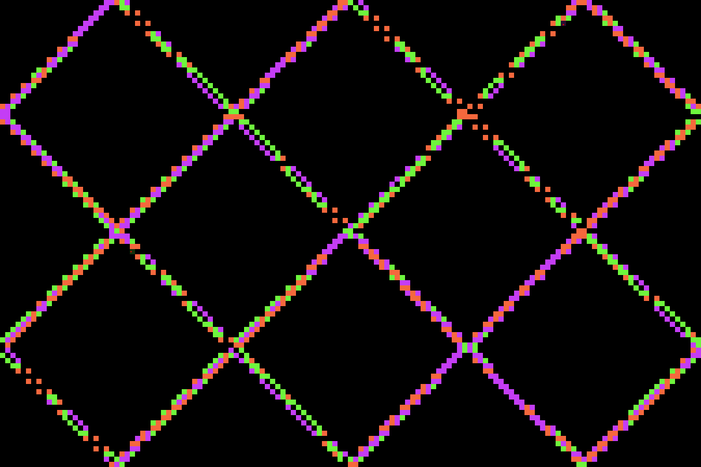
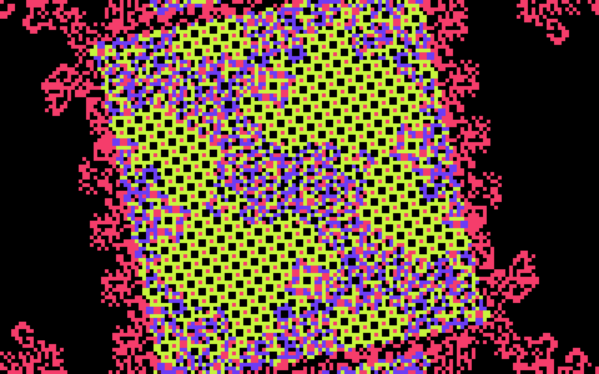
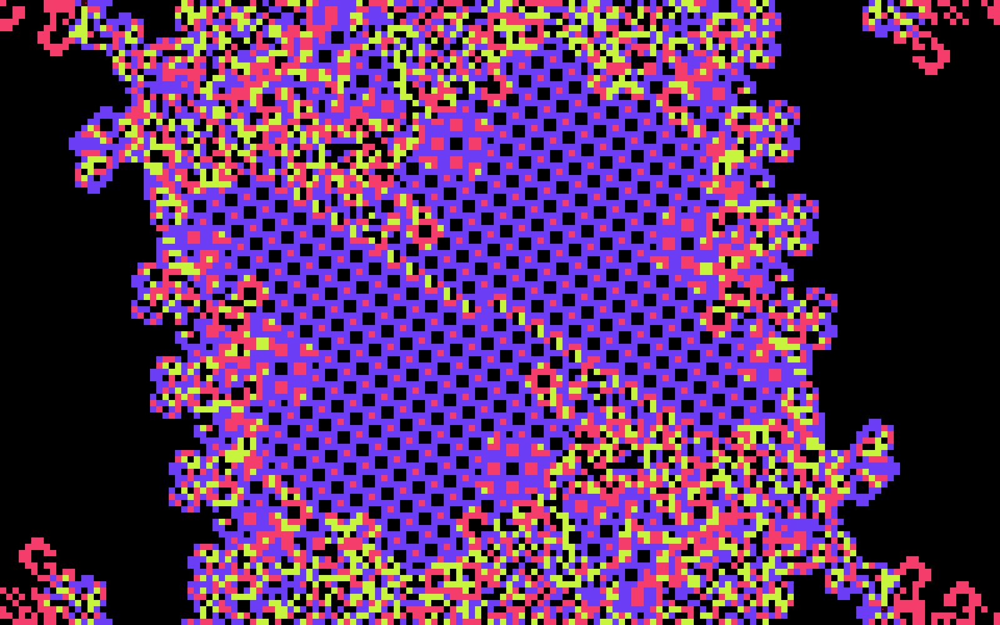

# Ant Farm Simulator

This is a small browser project that simulates ant-like agents (turmites) moving across a grid. Each ant follows rules based on its current state and the colour of the cell it is standing on. The simulation produces a wide range of patterns, from simple trails to more complex structures.

The project is written in plain HTML, CSS and JavaScript. There are no external dependencies. Everything runs locally in the browser.

### Live Version
https://jmakesthingswith.github.io/antfarm-simulator/

---

## How it works

The simulation uses a grid where every cell stores a colour index. Ants move across the grid and update their direction, state and the cell colour according to a ruleset. Changing the number of states or colours can completely change the behaviour.

A control panel is included for adjusting rulesets, speed, presets and other settings. The stats overlay shows performance details and a condensed summary of the active rules.

---

## Running the project

Clone the repository or download the files,
then run it through a local web server (required for ES-module loading).

Open a terminal in the project folder and run:
```bash

python3 -m http.server

```

Then visit `http://localhost:8000` in your browser.

---

## Project Files

- index.html – sets up the canvas, overlays and UI elements

- style.css – dark theme, UI styling, and pixel rendering

- main.js – app setup, event handling and UI connections

- simulation.js – core ant/turmite movement and grid state updates

- renderer.js – drawing the grid, ants, transitions and visual effects

- presets.js – predefined rulesets

- ruleGenerator.js – random rule generation and rule mutation

- utils.js – helper utilities, including a deep clone function to prevent preset rules from being overwritten

---

## Features

- Editable rulesets with multiple states and colours

- Random rule generator

- Several built-in presets

- Rule summary in the stats overlay

- Pause, reset and speed controls

- Optional Truchet-style preset for tile-based patterns

- Smooth colour transitions when switching palettes

- Mutated rule variants that extend presets without altering them (deep cloning ensures reproducibility)

- Randomizer automatically produces Truchet patterns when Truchet mode is active

---

## Example Patterns

A collection of interesting or emergent patterns generated by the simulator. JSON files in the /example folder can be imported directly into the simulator.

- **Oscillating Diamonds** — A rotating multi-oscillator lattice that forms repeating diamond structures with shifting colours.




- **The Period-20 Void Weaver** -
This rule was randomly discovered after implementing a strict spawn preset toggle and playing around with the 3x3 grid spawn preset (Note: Presets for spawning aren't completely limited to fully strict spawns, there are generational rules that continue to shake up the ant logic. Adding constraints allows for higher chances of intelligent, emergent and sometimes completely biased patterns, bridging the gap between order and chaos). The result is the Period-20 Void Weaver: a 5-state, 4-color pattern that exhibits a complex multi-phase meta-loop. It first constructs a layered, crystalline weave before populating the outer edges with 'transitional chaos.' The ant then turns back, consuming itself to form a temporary shell. The cycle continues as the ant spirals inwards, then back out with a new colour foundation. The transitional pattern takes over the shell remains before the ant finally spirals inward, consumes all remaining structure, dances around the center for a second, and begins the cycle anew

| Early Stage | Developed Stage |
| :---: | :---: |
|  |  |
---

More examples will be added over time in the `/examples` folder.
  
---

## in-depth notes and future potential development

The project is split into simple modules. main.js coordinates everything, while simulation logic and rendering stay separate. UI controls are straightforward and easy to extend.

What's working well:

- Clear separation between simulation, rendering and UI
- Ruleset summary overlay is compact and useful
- Randomizer explores rule-space widely, including:
- Cellular Automata–style rules
- Sacred Geometry–style rules
- Wolfram-style rules
- Mutated versions of existing presets
- Multiple geometric spawn patterns
- Stochastic turn, write and state transitions
- Variable numbers of states and colours
- Light emergent-behaviour bias to avoid trivial or dead patterns
- Stable performance due to typed arrays and efficient stepping
- Built-in undo/redo support

Improvements:
- Truchet mode probably deserves its own engine instead of being adapted through turmite logic
- Renderer and simulation could share a single config object
- Colour themes could be saved as presets
- Heatmap mode will likely be removed. Smooth colour toggle is currently cosmetic with plans to make it functional.
- Some refactoring and cleanup
- Review the randomizer and preset libraries, and expand colour-related features
- Add a JSON Ruleset gallery folder and populate with exported rulesets
- Colour patterns/themes have no rule to not repeat single colours, leading to visual and rule errors, needs fixing.

---

## Acknowledgements

This project was inspired by Youtube's Emergent Garden and their Ant/Turmite Simulation, the code was built upon that.
